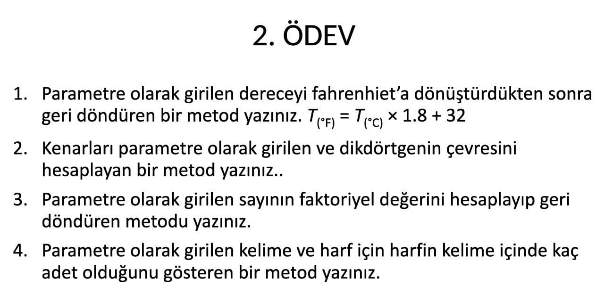
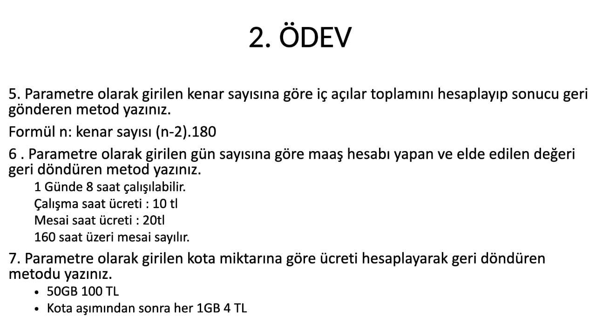
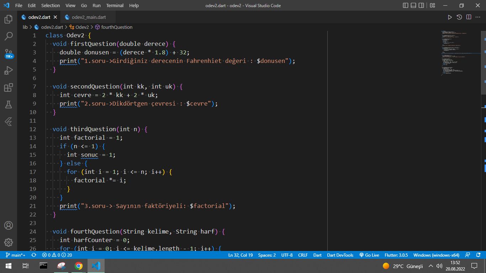
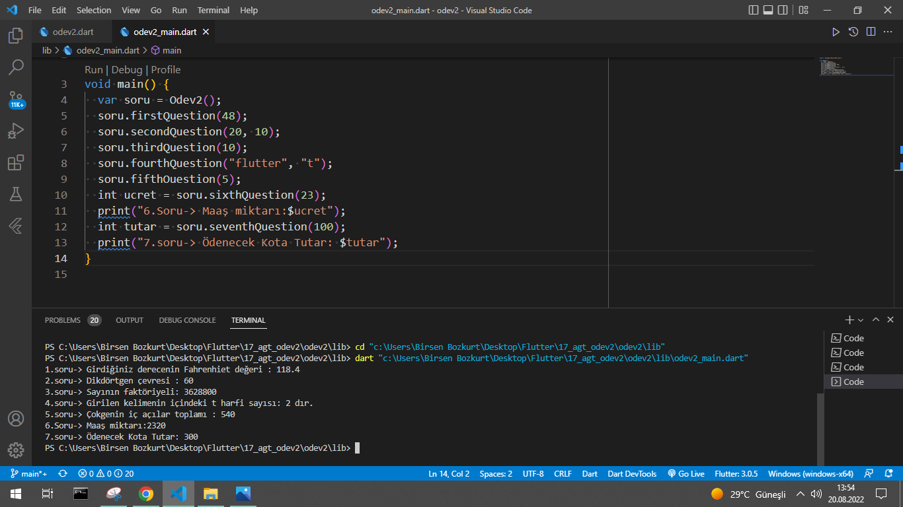

# odev2

Bu proje dosyası Kasım Adalan Hocamın FLUTTER bootcampte verdiği ödevdir, görsellerini eklediğim soruları class yapısını kullanarak ve algoritmik düşünme sistemiyle ödevimi gerçekleştirdim

## Odev Soruları

## Function İmages

